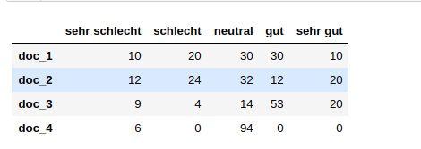
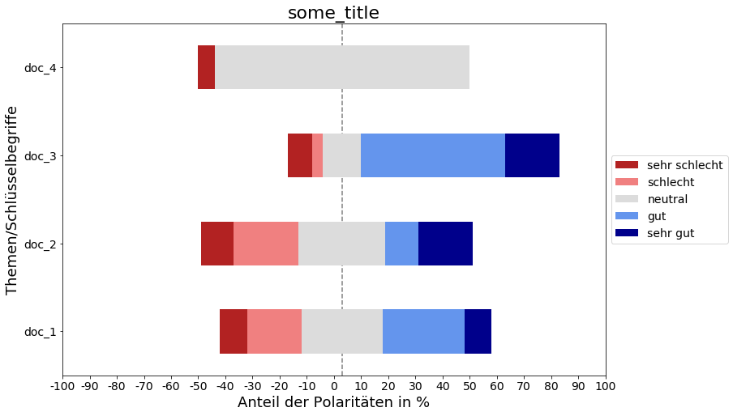

# SentiPete Package (only german support!)

## Description

* This package provides an easy sentiment-analysis-pipeline using spacy
* Only for german texts
* You can analyse your text for user-given keywords to get associated polarity-values
* Uses SpaCy's tokenizer/POS-tagger and dependency-parser to get keyword associated words
* Works with experimental polarity-enhancer, polarity-reducer, polarity-switcher (due to negations)
* Example: 
  <pre>
  Das Wetter  ist sehr     schön    . Zum Glück ist meine Freundin    nicht    blind.
      keyword     enhancer sentiment                      keyword     negation sentiment
      0.01215 <-  1.5   x  0.0081                         0.1978  <-  -1   x   -0.1978
  </pre>

## Installation notes

* Installation currently works online offline on your local platform
* Installation via terminal/cmd via:
```shell
git clone https://github.com/Max4Bio/SentiPete/
cd in/dir/of/this/README.md
pip install ./dist/sentipete-pkg-MaxImune-1.0.1.tar.gz # current release
```

## Preparations

* when you installed the package via pip,
you have to install the german spacy model
"de\_core\_news\_md" in a terminal/cmd:
```shell
python -m spacy download de_core_news_md
```

## Use

1. Import SentiDep:
```python
from sentipete.SentiDep import SentiDep
```
2. The easy and the hard way
  * __Possiblity 1__:
(_if you want only the keyword-associated polarity scores_)
Make an instance of the SentiDep-class and for easy analysis use
the "get_depending_polarities()"\-method with your own keywords and
a raw text to analyze:
```python
sd = SentiDep()
sentiment = sd.get_depending_polarities(some_text, some_keywords)
print(sentiment)
```
[
(keyword\_1, polarity\_score\_1, POS\_tag\_1)
...
]

  * __Possiblity 2__:
(_if you want to create a pandas dataframe and plot it_)
Make an instance of the SentiDep-class:
```python
sd = SentiDep()
```
Then you need a list of raw texts and some keywords and put it in the
"_create\_clinic\_polarity\_dict()_"\-method to generate a polarity dict:
```python
polarities = sd.create_clinic_polarity_dict(list_of_raw_texts, keywords)
```
_list\_of\_raw\_texts_ has to be in form: [[key\_1, text\_1], [key\_2, text\_2], ...]

You can create a dataframe by using the "_create\_polarity\_df()_"\-method:
```python
polarity_df = sd.create_polarity_df(polarities, keywords)
```
For plotting you can use the SentiPlotting\-class.
First you have to import and make an instance of SentiPlotting:
```python
from sentipete.SentiPlotting import SentiPlotting
sp = SentiPlotting()
```
You can now prepare the dataframe for plotting using the
"prepare\_for\_polarityplot()"\-method:
```python
intervals_df = sp.prepare_for_polarityplot(polarity_df)
```
 <Br/>
For showing a nice lickert\-plot of the polarity\-distribution,
you can use the "polarityplot\_lickert()"\-method:
```python
sp.polarityplot_lickert(intervals_df,
                          title="some_title",
                          figure_save_path="path/to/image.png")
```

